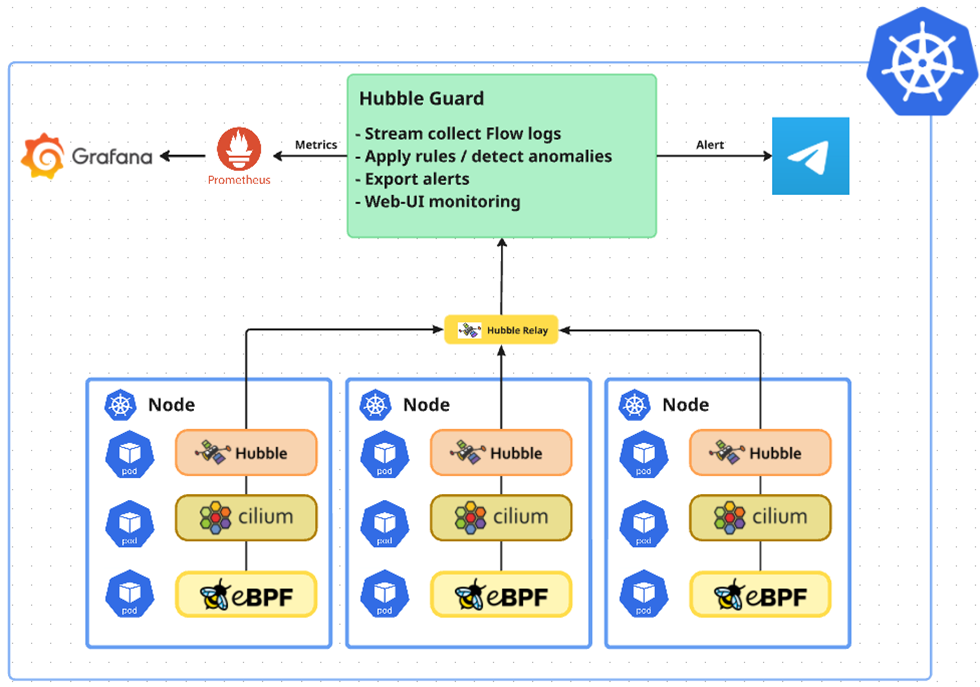

# Hubble Guard

Hệ thống phát hiện bất thường mạng trong Kubernetes sử dụng Cilium Hubble.

---

## 1. Kiến trúc tổng thể



### Thành phần chính Hubble Guard

| Thành phần | Mô tả |
|-----------|-------|
| **Anomaly Detector** | Phân tích flows và phát hiện bất thường theo rules |
| **API Server** | REST API cung cấp dữ liệu cho UI |
| **UI** | Giao diện web quản lý và giám sát |

---

## 2. Tính năng

### 2.1. Phát hiện bất thường (Anomaly Detection)

- **Real-time Detection**: Phân tích network flows trực tiếp từ Hubble gRPC stream
- **Rule-based Engine**: Hệ thống rules linh hoạt, có thể bật/tắt và cấu hình threshold
- **Baseline Learning**: Tự động học baseline traffic để phát hiện anomaly
- **Multi-channel Alerting**: Gửi cảnh báo qua Telegram, Webhook, Log

### 2.2. Giao diện người dùng (UI)

- **Dashboard**: Tổng quan về trạng thái hệ thống và alerts
- **Alert Management**: Xem, xác nhận và quản lý các cảnh báo
- **Grafana Integration**: Embed dashboard Grafana để visualize metrics
- **Real-time Updates**: Cập nhật dữ liệu real-time qua API polling

---

## 3. Các luật phát hiện (Detection Rules)

| Rule | Severity | Mô tả |
|------|----------|-------|
| **ddos** | CRITICAL | Phát hiện DDoS attack real-time khi traffic vượt ngưỡng 10x baseline |
| **traffic_death** | CRITICAL | Phát hiện service chết khi traffic rate = 0 nhưng trước đó có baseline |
| **traffic_spike** | CRITICAL | Phát hiện traffic spike bất thường (3x baseline) từ Prometheus metrics |
| **namespace_access** | HIGH | Phát hiện truy cập trái phép đến namespace nhạy cảm (monitoring, security...) |
| **suspicious_outbound** | HIGH | Cảnh báo kết nối đến các port nguy hiểm: Telnet (23), SMB (445), MySQL (3306)... |
| **block_connection** | HIGH | Phát hiện DROP flows (connections bị chặn bởi Network Policy) |
| **unusual_traffic** | HIGH | Phát hiện traffic từ sources không được phép |
| **port_scan** | HIGH | Phát hiện port scanning (>20 unique ports trong 30s) |

### Cấu hình Rules

Rules được cấu hình trong `values.yaml`:

```yaml
rules:
  - name: "ddos"
    enabled: true
    severity: "CRITICAL"
    thresholds:
      multiplier: 10.0

  - name: "namespace_access"
    enabled: true
    severity: "HIGH"
    thresholds:
      forbidden_namespaces:
        - "monitoring"
        - "security"
```

---

## 4. Cài đặt

### 4.a. Môi trường Development

#### Yêu cầu

- Go 1.21+
- Docker & Docker Compose
- Kubernetes cluster (Minikube/Kind/Docker Desktop)
- Cilium + Hubble đã cài đặt
- Helm 3.0+

#### Bước 1: Clone repository

```bash
git clone https://github.com/your-repo/hubble-guard.git
cd hubble-guard
```

#### Bước 2: Đảm bảo cài đặt Cilium với Hubble

```bash
# Cài đặt Cilium CLI
curl -L --remote-name-all https://github.com/cilium/cilium-cli/releases/latest/download/cilium-linux-amd64.tar.gz
sudo tar xzvfC cilium-linux-amd64.tar.gz /usr/local/bin

# Cài đặt Cilium với Hubble enabled
cilium install --set hubble.relay.enabled=true --set hubble.ui.enabled=true

# Kiểm tra trạng thái
cilium status
```

#### Bước 3: Build và chạy local

```bash
# Install dependencies
make deps

# Chạy Anomaly Detector
make run

# Chạy API Server (terminal khác)
make api-run
```

#### Bước 4: Chạy UI (development mode)

```bash
cd ui
npm install
npm run dev
```

### 4.b. Môi trường Production

#### Yêu cầu

- Kubernetes cluster 1.19+ (GKE, EKS, AKS, on-premise)
- Cilium CNI đã cài đặt với Hubble enabled
- Helm 3.0+
- Ingress Controller (nginx-ingress recommended)
- (Optional) Cert-Manager cho HTTPS

#### Bước 1: Đảm bảo cài đặt Cilium với Hubble

```bash
cilium status
```

#### Bước 2: Chỉnh sửa file values production

```yaml
# Production values
application:
  hubble_server: "hubble-relay.kube-system.svc.cluster.local:80"

# Cấu hình alerting
alerting:
  enabled: true
  channels:
    telegram: true
  telegram:
    bot_token: "YOUR_BOT_TOKEN"
    chat_id: "YOUR_CHAT_ID"

# Rules configuration
rules:
  - name: "ddos"
    enabled: true
    severity: "CRITICAL"
    thresholds:
      multiplier: 10.0
  
  - name: "namespace_access"
    enabled: true
    severity: "HIGH"
    thresholds:
      forbidden_namespaces:
        - "kube-system"
        - "monitoring"

# Resources cho production
anomalyDetector:
  replicaCount: 2
  resources:
    limits:
      cpu: 2000m
      memory: 1Gi
    requests:
      cpu: 500m
      memory: 256Mi

prometheus:
  persistence:
    enabled: true
    size: 50Gi
    storageClass: "standard"
  retention: "30d"

grafana:
  adminPassword: "SECURE_PASSWORD_HERE"

# UI với Ingress
ui:
  ingress:
    enabled: true
    className: "nginx"
    annotations:
      cert-manager.io/cluster-issuer: "letsencrypt-prod"
    hosts:
      - host: hubble-guard.your-domain.com
        paths:
          - path: /
            pathType: Prefix
    tls:
      - secretName: hubble-guard-tls
        hosts:
          - hubble-guard.your-domain.com
```

#### Bước 3: Deploy với Helm

```bash

# Deploy
helm upgrade --install hubble-guard ./helm/hubble-guard \
  -n hubble-guard \
  --create-namespace \
  -f production-values.yaml

# Kiểm tra deployment
kubectl get pods -n hubble-guard
kubectl get svc -n hubble-guard
kubectl get ingress -n hubble-guard
```

#### Bước 4: Verify deployment

```bash
# Kiểm tra tất cả pods đang chạy
kubectl get pods -n hubble-guard -w

# Kiểm tra logs
kubectl logs -f deployment/hubble-guard-anomaly-detector -n hubble-guard
kubectl logs -f deployment/hubble-guard-api-server -n hubble-guard

# Kiểm tra Prometheus targets
kubectl port-forward svc/hubble-guard-prometheus 9090:9090 -n hubble-guard
# Truy cập: http://localhost:9090/targets
```


