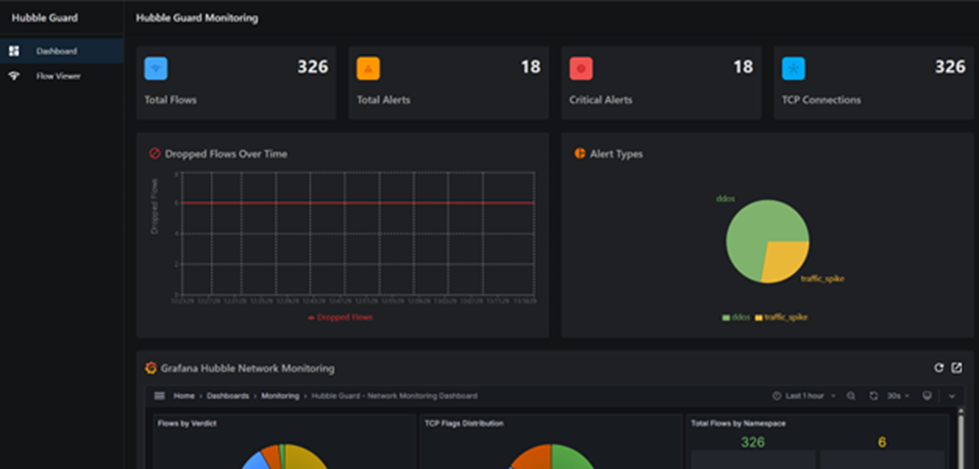
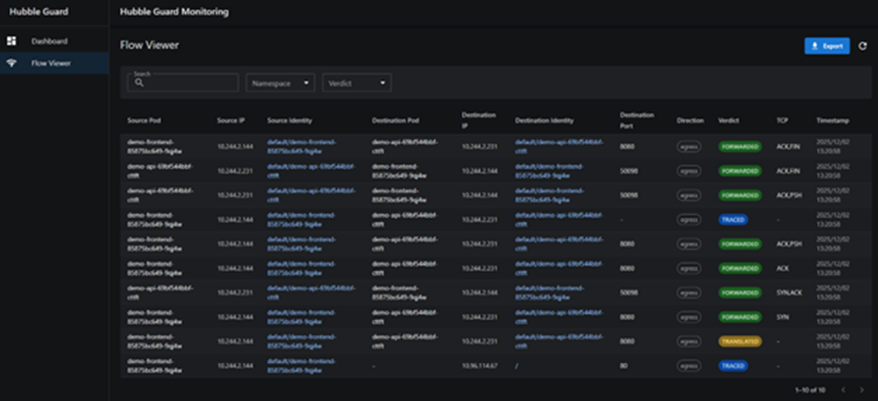

# Hubble Guard

Mornitoring and anomaly detection system for Kubernetes using eBPF technology.

---

## 1. Architecture


### Core Components

| Component | Description |
|-----------|-------------|
| **Anomaly Detector** | Analyzes network flows and detects anomalies based on configurable rules |
| **API Server** | REST API providing data for the UI |
| **UI** | Web interface for monitoring and management |

---

## 2. Features

### 2.1. Anomaly Detection

- **Real-time Detection**: Analyzes network flows and detects anomalies in real-time
- **Multi-channel Alerting**: Sends alerts via Telegram, Webhook, Log

### 2.2. Network Monitoring (UI)

- **Dashboard**: Overview of system status and alerts
- **Alert Management**: View, acknowledge, and manage alerts
- **Grafana Integration**: Embedded Grafana dashboard for metrics visualization
- **Real-time Updates**: Real-time data updates via API polling

#### Dashboard



#### Flow Viewer



---

## 3. Detection Rules

| Rule | Severity | Description |
|------|----------|-------------|
| **ddos** | CRITICAL | Detects DDoS attacks in real-time when traffic exceeds 10x baseline |
| **traffic_death** | CRITICAL | Detects service death when traffic rate = 0 but previously had baseline |
| **traffic_spike** | CRITICAL | Detects abnormal traffic spikes (3x baseline) from Prometheus metrics |
| **namespace_access** | HIGH | Detects unauthorized access to sensitive namespaces (monitoring, security...) |
| **suspicious_outbound** | HIGH | Alerts on connections to dangerous ports: Telnet (23), SMB (445), MySQL (3306)... |
| **block_connection** | HIGH | Detects DROP flows (connections blocked by Network Policy) |
| **unusual_traffic** | HIGH | Detects traffic from unauthorized sources |
| **port_scan** | HIGH | Detects port scanning (>20 unique ports in 30s) |

### Rules Configuration

Rules are configured in `values.yaml`:

```yaml
rules:
  - name: "ddos"
    enabled: true
    severity: "CRITICAL"
    thresholds:
      multiplier: 10.0

  - name: "namespace_access"
    enabled: true
    severity: "HIGH"
    thresholds:
      forbidden_namespaces:
        - "monitoring"
        - "security"
```

---

## 4. Installation

### 4.a. Development Environment

#### Prerequisites

- Go 1.21+
- Docker & Docker Compose
- Kubernetes cluster (Minikube/Kind/Docker Desktop)
- Cilium + Hubble installed
- Helm 3.0+

#### Step 1: Clone repository

```bash
git clone https://github.com/your-repo/hubble-guard.git
cd hubble-guard
```

#### Step 2: Ensure Cilium with Hubble is installed

```bash
# Install Cilium CLI
curl -L --remote-name-all https://github.com/cilium/cilium-cli/releases/latest/download/cilium-linux-amd64.tar.gz
sudo tar xzvfC cilium-linux-amd64.tar.gz /usr/local/bin

# Install Cilium with Hubble enabled
cilium install --set hubble.relay.enabled=true --set hubble.ui.enabled=true

# Check status
cilium status
```

#### Step 3: Build and run locally

```bash
# Install dependencies
make deps

# Run Anomaly Detector
make run

# Run API Server (in another terminal)
make api-run
```

#### Step 4: Run UI (development mode)

```bash
cd ui
npm install
npm run dev
```

### 4.b. Production Environment

#### Prerequisites

- Kubernetes cluster 1.19+ (GKE, EKS, AKS, on-premise)
- Cilium CNI installed with Hubble enabled
- Helm 3.0+
- Ingress Controller (nginx-ingress recommended)
- (Optional) Cert-Manager for HTTPS

#### Step 1: Ensure Cilium with Hubble is installed

```bash
cilium status
```

#### Step 2: Edit production values file

```yaml
# Production values
application:
  hubble_server: "hubble-relay.kube-system.svc.cluster.local:80"

# Alerting configuration
alerting:
  enabled: true
  channels:
    telegram: true
  telegram:
    bot_token: "YOUR_BOT_TOKEN"
    chat_id: "YOUR_CHAT_ID"

# Rules configuration
rules:
  - name: "ddos"
    enabled: true
    severity: "CRITICAL"
    thresholds:
      multiplier: 10.0
  
  - name: "namespace_access"
    enabled: true
    severity: "HIGH"
    thresholds:
      forbidden_namespaces:
        - "kube-system"
        - "monitoring"

# Production resources
anomalyDetector:
  replicaCount: 2
  resources:
    limits:
      cpu: 2000m
      memory: 1Gi
    requests:
      cpu: 500m
      memory: 256Mi

prometheus:
  persistence:
    enabled: true
    size: 50Gi
    storageClass: "standard"
  retention: "30d"

grafana:
  adminPassword: "SECURE_PASSWORD_HERE"

# UI with Ingress
ui:
  ingress:
    enabled: true
    className: "nginx"
    annotations:
      cert-manager.io/cluster-issuer: "letsencrypt-prod"
    hosts:
      - host: hubble-guard.your-domain.com
        paths:
          - path: /
            pathType: Prefix
    tls:
      - secretName: hubble-guard-tls
        hosts:
          - hubble-guard.your-domain.com
```

#### Step 3: Deploy with Helm

```bash
# Deploy
helm upgrade --install hubble-guard ./helm/hubble-guard \
  -n hubble-guard \
  --create-namespace \
  -f production-values.yaml

# Check deployment
kubectl get pods -n hubble-guard
kubectl get svc -n hubble-guard
kubectl get ingress -n hubble-guard
```

#### Step 4: Verify deployment

```bash
# Check all pods are running
kubectl get pods -n hubble-guard -w

# Check logs
kubectl logs -f deployment/hubble-guard-anomaly-detector -n hubble-guard
kubectl logs -f deployment/hubble-guard-api-server -n hubble-guard

# Check Prometheus targets
kubectl port-forward svc/hubble-guard-prometheus 9090:9090 -n hubble-guard
# Access: http://localhost:9090/targets
```

---

## License

MIT License
